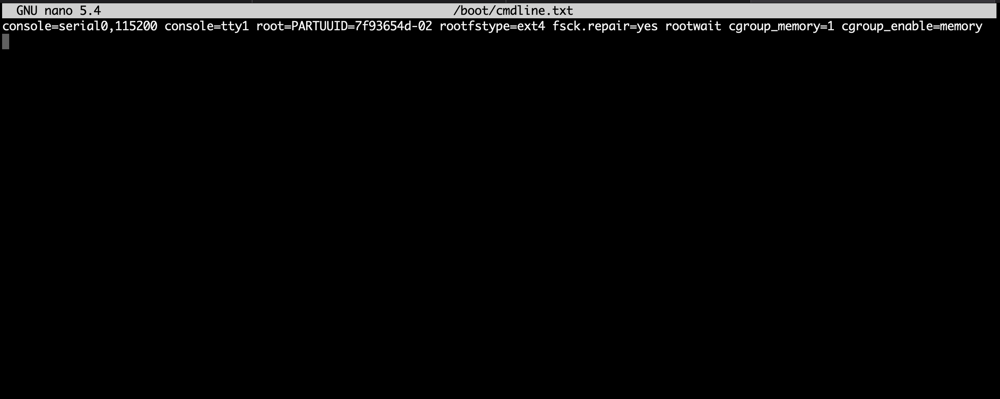
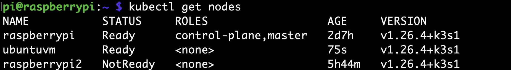
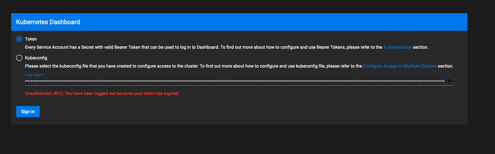
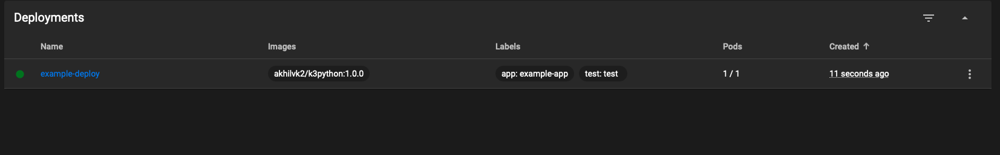

# Kubernetes_Python_Deployment
This repository outlines a project I completed to run python appliations on a homemade K3s cluster. I will go through all the code and commands ran to complete to compelete each step so this project can be replicated. 

## Table of Contents 
1. [Cluster Setup](#cluster-setup)
2. [Raspberry Pis](#raspberry-pis)
3. [Ubuntu VM](#ubuntu-vm)
4. [Verify](#verify-cluster-configuration)
5. [Kubernetes Dashboard](#kubernetes-dashboard)
6. [Creating Docker image containg Python App](#creating-docker-image-containg-python-app)
7. [Running Python App on Kubernetes Cluster](#running-python-app-on-kubernetes-cluster)
8. [Conclusion](#conclusion)

<a name="Cluster Setup"></a>
## Cluster Setup
The first step is to assemble all the nodes for the Kubernetes cluster. For my project, I wanted the ability to create a Kubernetes with nodes of different hardware. 

I used the following as nodes:
- Raspberry Pi 3B+
- Raspberry Pi 2B
- 1 Ubuntu VM running on a Macbook M1

<a name="Raspberry Pis"></a>
## Raspberry Pis

For both of the pis used in this project, I used the [Raspberry Pi Imager](https://www.raspberrypi.com/software/) application to format the sd cards for both. I installed Raspberry Pi Lite 64 Bit for the 3B+ and Raspberry Pi Lite 32 Bit for the 2B. Note that this is a mandatory setup because older models of the Pi cannot run 32 bit archectectures. Typically, k3s cannot run well on 32bit archectectures, but I did not encounter any issues with my cluster. 

### Raspberry Pi 3B+
- role: master
- image: Raspberry Pi Lite 64 Bit
- buy link: https://www.raspberrypi.com/products/raspberry-pi-3-model-b-plus/

### Steps

ssh into the pi from your computer

```
ssh username@ip-address
```


Update the pi

```
sudo apt-get update && sudo apt-get upgrade -y
```

Edit pi config to allow for fixed memory alloation for jobs. This must be done by enabling cgroup in command line arguements

```
sudo nano /boot/cmdline.txt
```

Add to the end of the file: 
```
cgroup_memory=1 cgroup_enable=memory
```

The file should like the following


Reboot Pi

```
sudo reboot
```

Install K3s 

```
curl -sfL https://get.k3s.io | sh -
```

Run the following command to obtain a token that will be neccessary to joining nodes to the cluster 

```
sudo cat /var/lib/rancher/k3s/server/node-token
```

Take note of this token, as it will be used in the following parts

### Helpful resource
https://www.youtube.com/watch?v=rOXkutK8ANc&t=1581

### Raspberry Pi 2B
- role: worker
- image: Raspberry Pi Lite 32 Bit
- buy link: https://www.raspberrypi.com/products/raspberry-pi-2-model-b/

### Steps

ssh into the pi from your computer

```
ssh username@ip-address
```


Update the pi

```
sudo apt-get update && sudo apt-get upgrade -y
```

Edit pi config to allow for fixed memory alloation for jobs. This must be done by enabling cgroup in command line arguements

```
sudo nano /boot/cmdline.txt
```

Add to the end of the file: 
```
cgroup_memory=1 cgroup_enable=memory
```

The file should like the following


Reboot Pi

```
sudo reboot
```

Install K3s and add node to cluster 

```
curl -sfL https://get.k3s.io | K3S_URL=https://ip-address:6443 K3S_TOKEN=node-token sh -
```

### Helpful resource
https://www.youtube.com/watch?v=rOXkutK8ANc&t=1581

<a name="Ubuntu VM"></a>
## Ubuntu VM
- role: worker
- image: Ubuntu 22.04

I am using a Macbook Pro with the M1 as my host. To configure the VM, I used [UTM](https://mac.getutm.app). If you are a first time user, A good video to refer to in configuring the VM is the following: https://www.youtube.com/watch?v=O19mv1pe76M&t=549s

### Steps
Update the VM

```
sudo apt-get update && sudo apt-get upgrade -y
```

Install K3s and add node to cluster 

```
curl -sfL https://get.k3s.io | K3S_URL=https://ip-address:6443 K3S_TOKEN=node-token sh -
```

<a name="Verify Cluster Configuration"></a>
## Verify Cluster Configuration
To verify that all the nodes were correctly added to the cluster run 
```
kubectl get nodes
```



<a name="Kubernetes Dashboard "></a>
## Kubernetes Dashboard 
Before going on, it is a good idea to expose the cluster to connections outside of the cluster, so you can view information about the cluster locally. To do this, you need to get the deployment information from one of the nodes and add the information to your local kuberenets config file. This only has to be done once. I will show how to do this.

On my pi I ran `sudo cat /etc/rancher/k3s/k3s.yaml`

Output:

```
apiVersion: v1
clusters:
- cluster:
    certificate-authority-data: ""
    server: https://127.0.0.1:6443
  name: default
contexts:
- context:
    cluster: default
    user: default
  name: default
current-context: default
kind: Config
preferences: {}
users:
- name: default
  user:
    client-certificate-data: ""
    client-key-data: ""
```

Adapt the output to kubernetes config on your local machine. For example, I am using my macbook and thus the config file is in ` sudo cat ~/.kube/config`. Notice which parts of the pi's config file is adapted to the config file of the macbooks

```
apiVersion: v1
clusters:
- cluster:
    certificate-authority-data: ""
    server: https://kubernetes.docker.internal:6443
  name: docker-desktop
- cluster:
    certificate-authority-data: ""
    server: https://127.0.0.1:52101
  name: kind-kind
- cluster: # TODO
    certificate-authority-data: ""
    server: https://192.168.68.125:6443 # TODO
  name: pi_w
contexts:
- context:
    cluster: docker-desktop
    user: docker-desktop
  name: docker-desktop
- context:
    cluster: kind-kind
    user: kind-kind
  name: kind-kind
- context:
    cluster: ""
    namespace: default
    user: ""
  name: my-cluster
- context: # TODO
    cluster: pi_w 
    user: pi_w
  name: pi_w # TODO
current-context: pi_w # TODO
kind: Config
preferences: {}
users:
- name: docker-desktop
  user:
    client-certificate-data: ""
    client-key-data: ""
- name: kind-kind
  user:
    client-certificate-data: ""
    client-key-data: ""
- name: pi_w # TODO
  user:
    client-certificate-data: ""
```

After these steps you should be able to view your deployment by running `kubectl get contexts` on your local machine

One cool feature kuberentes reccomends is a dashboard on browser to monitor your deployments. To view the dashboard execute the following:

```
kubectl apply -f https://raw.githubusercontent.com/kubernetes/dashboard/v2.7.0/aio/deploy/recommended.yaml


kubectl proxy # keep this running to access dashboard

```

Access the dashboard with the following link: http://localhost:8001/api/v1/namespaces/kubernetes-dashboard/services/https:kubernetes-dashboard:/proxy/

You may be prompted to provide a token to sign in. To obtain the token, run the following command `kubectl -n kubernetes-dashboard create token admin-user`. Now paste the token on the sign in page. 



### Helpful resource

https://www.youtube.com/watch?v=rOXkutK8ANc&t=1581s

<a name="Creating Docker image containg Python App"></a>
## Creating Docker image containg Python App

To recap, the goal of this project was to create a kubernetes deployment that can handle any python app. The next part in the process is to package a python file into a docker image that can be deployed to a kuberetes cluster for completion. In order to create a docker image, make sure to have a [docker hub](https://hub.docker.com/) account and [docker desktop](https://www.docker.com/products/docker-desktop/) installed. 

Make sure to run `docker login` to make sure that your terminal session can access dockerhub. 

To make it easier, I reccomend following the direcotry structure of this repository. Put the python file that you want to run in the `src` folder, and create a `dockerfile` and `docker-compose.yaml` files that define how the image will be run and containerized. The code provided in both of the files represent the bare minimum needed to create a docker image. 

After completing the two files, run `docker-compose build app_name` to build the docker image. Note this may take sometime. 

To test whether or not your image is running normal, I reccomend running `docker-compose up k3python`. If everything is running normally, run `docker-compose push k3python`, to push the image to docker hub. 


<a name="Running Python App on Kubernetes Cluster"></a>
## Running Python App on Kubernetes Cluster

Refer to the `kubernetes/deployments/deployment.yaml` file for information on key parts of any kubernetes deployment. 

Once the file is completed, you are now ready to start your app on your kubernetes cluster. To do this run `kubectl apply -f ./kubernetes/deployments/deployment.yaml`. You can view the status of your deployment on the dashboard created or by running `kubectl describe deployment deployment-name`. 




### Helpful resource

https://www.youtube.com/watch?v=rOXkutK8ANc&t=1581s


<a name="Conclusion"></a>
## Conclusion

By this point you should have the knowledge to create your python app that can run on your own kubernetes deployment. Hopefully this experience was informative and fun!

